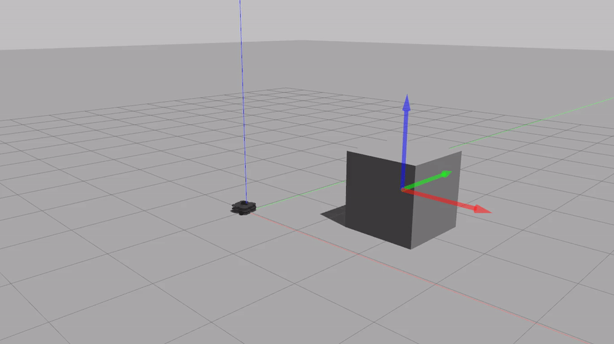

# warmup_project

## Drive in a square 
*For this problem, I needed to 1) make the robot move forward in a straight line and 2) make the robot turn 90 degrees 3) repeat 1 & 2. I used the Twist library, which allowed me to set a linear (moving forward) and angular (turning) velocity. I used rospy.sleep to control the timing. I determined the sleep values experimentally. 

*My code follows a simple object oriented template of an init and run function. The init function initializes the node and publisher. The run function moves the robot forward, turns hit approx. 90 degrees, and repeats.

## Person Follower 

To solve this problem, i needed to 1) make the robot continuously follow an object at a fixed distance 2) make the robot face the object 3) deal with an edge case.  I divided the code into a couple different cases based on the starting position of the robot and object. For each case, i adjusted the linear/angular velocity as needed and set a threshold for closeness. I made small adjustments on a rapid basis, as the robot needs to be reactive to changes in the object's position. 

My code follows a simple object oriented template of an init and run function, plus a process scan function that does the heavy lifting. The init function initializes the node and publisher. The run function calls spin, which runs process scan on a constant basis. Process scan has 4 cases. First, the case where an object is not in sight, in which case the robot spins with the goal of aligning its front scanner with the object. Next, the case in which the object is more than a safe distance away, in which case the robot moves toward it linearly. Next, the case where the robot is placed too close to the object, in which case it backs away to a safer distance. Finally, the case in which the robot is at a safe distance and can stop moving. 

 

## Wall Follower 

To solve this problem, I needed to 1) make the robot find a starting wall 2) OR backup if starting point was too close to a wall 3) keep robot a fixed distance from wall while moving linearly 4) turn corners. I divided the code into a couple different cases based on the relative positions of the robot and wall according to the scanner data. For each case, i adjusted the linear/angular velocity as needed and set a threshold for closeness. I made small adjustments on a rapid basis, as the robot needs to be reactive to constant movement, drift, and upcoming obstacles. 

My code follows a simple object oriented template of an init and run function, plus a process scan function that does the heavy lifting. The init function initializes the node and publisher. The run function calls spin, which runs process scan on a constant basis. Process scan has several cases, including 1) backing up after starting too close to the wall 2) reached an appropriate distance 3) constantly adjusting position relative to wall based on front/right side scanner data. The numerical velocity values were determined experimentally through much trial and error. Additionally, I defined the front as the average of the min and max of a small range of degrees near 0 to account for noise. 

 

## Challenges 

I had a lot of trouble dealing with noise and imprecision in the robot motion and scan reads. Several of my approaches (see hundreds of lines of commented out code) depended on a level of precision that just wasn't possible. For instance, I tried to turn exactly 45 degrees using a time-based approach or calculate correct distance from corner using trigonometry. Ultimately, I opted for a more-forgiving but less clean approach that relied on constant measurements and small adjustments. I also had trouble determining sensible velocities magnitudes. For the most part, I just used guess and check. 

## Future Work 

If I had more time. I would want to explore my initial ideas for wall follower to see if they were viable. I think if I had figured out how to navigate imprecise readings, I could have made one of my approaches work, and that the result would have been better (less wobbly, neater corners). For person follower, I would want to try to make the robot take the most efficient path to its target rather than just spinning until the target is in front of it. I also would try to develop some sort of methodology for determining velocity magnitudes other than guess and check. Overall, I would fine tune my code to make the robot move more smoothly and efficiently, and try to anticipate corner cases I likely missed. 

## Takeaways 

**Anticipate imprecision** I often found myself wondering if my code was wrong or if I was just dealing with fuzzy reads. This lead to a lot of frustration and commented out code. The lesson here is to brainstorm approaches that do not rely on perfect readings unless you know exactly how much to correct for imprecision.  

**Small adjustments at rapid intervals are effective** To deal with takeaway #1, I employed this strategy. While it didn't yield perfect results, it did accomplish the goal, and likely could have been fine tuned for better precision. Perhaps because 3D space/movement is so dynamic, this approach may be better than a static, precision-based approach with a carefully-calculated correction factor. 

**Think about corner cases** We were told to consider a specific corner case for person follower (3m directly behind robot). However, there were other corner cases in this project that we needed to consider. For example, the case where the robot was placed too close to the object or wall at the start, or the case where the robot wedges itself against the wall and gets stuck. In future assignments, determining corner cases will be important. 
